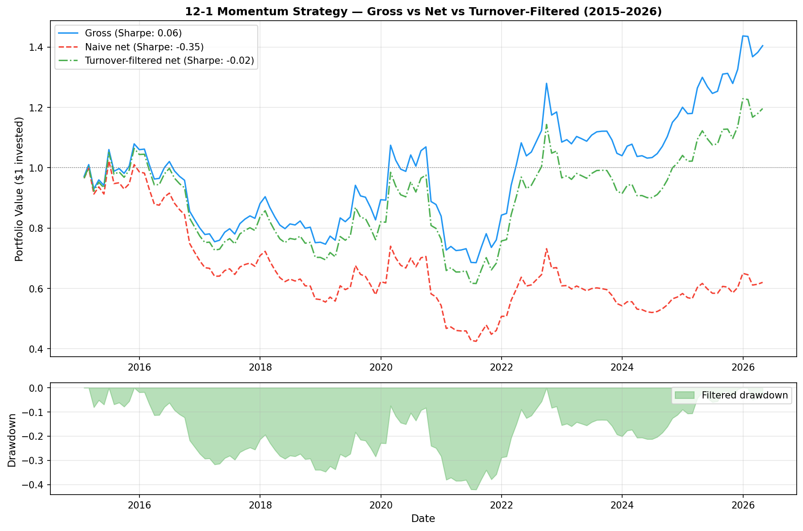

# 12-1 Cross-Asset Momentum Strategy

A systematic long-short momentum strategy built from scratch in Python, 
backtested across 10 diversified ETFs from 2015 to 2026.

## Motivation

Momentum — the tendency of recent winners to keep winning and recent losers 
to keep losing — is one of the most well-documented anomalies in finance. 
This project implements the classic 12-1 specification (12-month lookback, 
skip most recent month to avoid short-term reversal) and stress-tests it 
against realistic transaction costs.

## Universe

10 ETFs selected across uncorrelated asset classes to ensure genuine return 
dispersion — a prerequisite for momentum to generate alpha:

| Ticker | Asset Class |
|--------|-------------|
| SPY | US Equities |
| EFA | International Developed |
| EEM | Emerging Markets |
| TLT | Long-term US Treasuries |
| GLD | Gold |
| VNQ | Real Estate (REITs) |
| XLE | Energy |
| XLF | Financials |
| XLV | Healthcare |
| DBC | Commodities |

## Methodology

**Signal construction:** Each month, compute cumulative returns from t-252 
to t-21 trading days (12-month lookback, skip 1 month). Rank all 10 assets 
by this score.

**Portfolio construction:** Go long the top 3 ranked assets, short the 
bottom 3, equal-weighted. Rebalance monthly.

**Transaction costs:** 10bps per trade assumed (realistic for ETFs). 
6 positions traded naively = 0.60% monthly drag = 7.20% annual drag.

**Turnover filter:** Only trade a position when its momentum rank changes 
sufficiently to justify the cost. This reduces average monthly trades from 
6.0 to 1.2 — an 80% reduction in turnover.

## Results

| Metric | Gross | Naive Net | Turnover-Filtered |
|--------|-------|-----------|-------------------|
| Annual Return | 3.04% | -4.13% | 1.59% |
| Annual Volatility | 17.32% | 17.32% | — |
| Sharpe Ratio | 0.06 | -0.35 | -0.02 |
| Max Drawdown | -36.50% | — | — |
| Hit Rate | 54.4% | — | — |



## Key Findings

**The signal works.** A 54.4% hit rate and positive gross return over 11 
years across multiple market regimes (2015 commodity crash, 2020 COVID, 
2022 rate hike cycle) confirms the momentum factor has genuine predictive 
power in a cross-asset setting.

**Costs kill naive momentum.** Monthly rebalancing generates a 7.2% annual 
cost drag that wipes out all gross alpha and then some — a critical finding 
that naive backtests routinely ignore.

**Turnover management recovers most of the alpha.** Reducing average monthly 
trades from 6.0 to 1.2 cuts the cost drag by 80%, recovering the strategy 
to near-breakeven after costs. This motivates the next step: combining 
momentum with a second factor (value or carry) to improve the gross Sharpe 
before costs.

## Limitations & Next Steps

- Single factor — adding value or carry would improve diversification of 
  the signal
- No leverage or position sizing — equal weighting is naive; 
  volatility-scaling each position would improve the Sharpe
- Short selling assumed costless — borrow costs on ETF shorts are low but 
  non-zero
- Momentum is known to crash during sharp reversals (COVID March 2020 
  visible in the drawdown chart)

## Tech Stack

- Python 3.10
- pandas, numpy, scipy
- yfinance (market data)
- matplotlib, seaborn

## How to Run

```bash
pip install numpy pandas matplotlib seaborn yfinance scipy
jupyter notebook momentum_strategy.ipynb
```